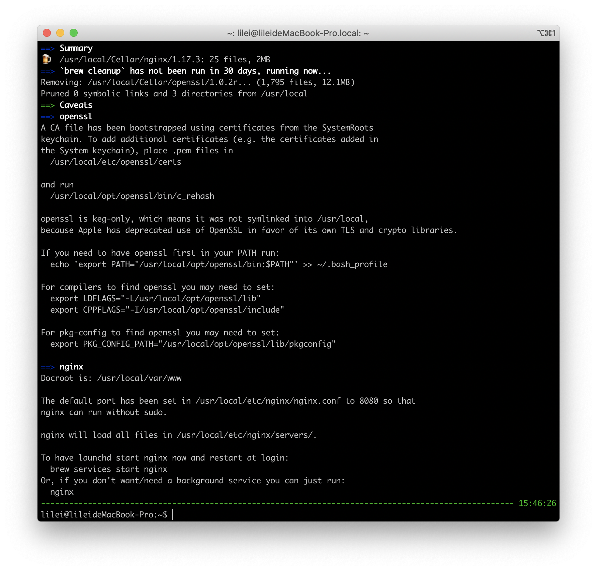

# nginx



``` bash
# Docroot is: /usr/local/var/www

# The default port has been set in /usr/local/etc/nginx/nginx.conf to 8080 so that nginx can run without sudo.

# nginx will load all files in /usr/local/etc/nginx/servers/.

# To have launchd start nginx now and restart at login:
$ brew services start nginx
# Or, if you don't want/need a background service you can just run:
$ nginx
```

